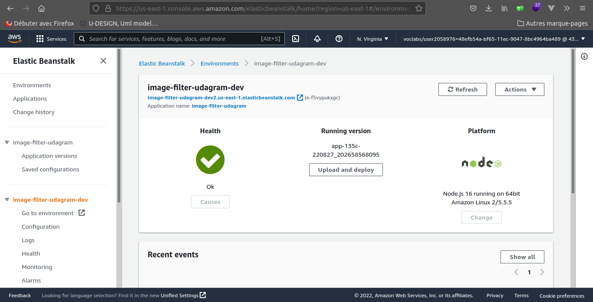

# Udagram Image Filtering Microservice

<a href="http://image-filter-udagram-dev2.us-east-1.elasticbeanstalk.com/" target="_blank">http://image-filter-udagram-dev2.us-east-1.elasticbeanstalk.com/</a>

# Note

We have slightly customized the default api page to make it user firendly 😋️. 
We change also `filterImageFromURL from './util/util'` as this helper function do not work for some large image link. New version are in util file. It use axios and the source is mentioned in util file. 

# Deployment screenshoot

# Description 

Udagram is a simple cloud application developed alongside the Udacity Cloud Engineering Nanodegree. It allows users to register and log into a web client, post photos to the feed, and process photos using an image filtering microservice.

### Run api

run `npm run dev` to start server